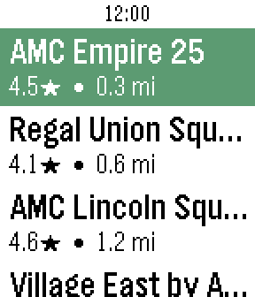
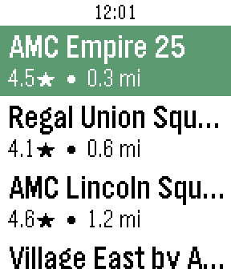

# Movie Times

A Pebble watchapp that uses your phone's location to list nearby movie theaters,
then shows each theater's movies, today's showtimes, and IMDb ratings.

  
  
  
  

  
  
  

## Controls

- **Select** — open a theater
- **Long-press Select** — pin it as a favorite (★, stays at the top; persists on the watch)
- **Shake** the theater screen — refresh past the cache

On touch watches, enable "Touch Navigation" in system settings to swipe-scroll,
tap a row, and swipe right to go back. The physical buttons keep working.

## API keys

Set these on the settings page (Pebble app → Movie Times):

| Service | For | Notes |
|---|---|---|
| [SerpApi](https://serpapi.com) | Theaters + showtimes | Required. Free tier is 100 searches/month; prefetch spends ~12 per refresh, so a paid plan or a longer cache window helps. |
| [OMDb](https://www.omdbapi.com) | IMDb ratings | Optional — ratings are just omitted without a key. |
| BigDataCloud | Reverse geocoding | Keyless, no setup. |

Responses are cached in the phone's `localStorage` (6 / 24 / 48 h, set on the
settings page). Opening the theater list quietly prefetches every theater's
showtimes so the rest of the day is instant. The settings page shows your real
SerpApi quota plus a local tally, and follows your phone's light/dark theme.

## Limitations

- Google only has a showtimes box for regions with cinema data (mainly US/CA and
  major metros). Elsewhere: "No showtimes listed".
- The watch's AppMessage inbox is 4 KB, so the movie list is capped at 14 titles.

Build instructions and internals are in `CLAUDE.md`.
