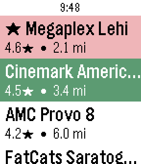
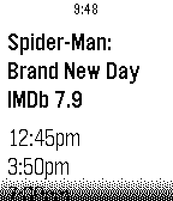
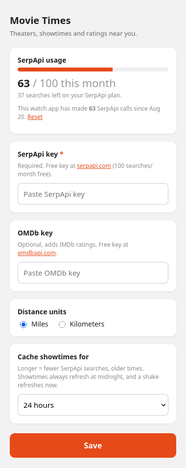

# Movie Times

A Pebble watchapp that uses your phone's location to list movie theaters near
you, then shows each theater's movies, today's showtimes, and IMDb ratings.

  
  
  
  

**Select** opens a theater; **long-press Select** pins it as a favorite (★, red
row) so it stays at the top of the list. Favorites persist on the watch.
**Shake** the theater screen to refresh past the cache.

## Data sources

- **[SerpApi](https://serpapi.com)** – nearby theaters (`google_maps` engine) and
  Google's showtimes box (`google` engine). Free tier is 100 searches/month.
- **[BigDataCloud](https://www.bigdatacloud.com)** – free reverse geocoding
  (lat/long → city) for the SerpApi `location` parameter. No key.
- **[OMDb](https://www.omdbapi.com)** – IMDb ratings. Optional; ratings are just
  omitted without a key.

### Caching

Responses are cached in the phone's `localStorage`:

- theater list — keyed by location (rounded to ~1 km), 24 h TTL
- a theater's showtimes — keyed by theater + date, 24 h TTL (so it expires at
  midnight anyway)

**Prefetch:** as soon as the theater list is shown, the phone quietly fetches
showtimes for *every* theater on the list into the cache (one SerpApi search
each, spaced out, yielding to anything you tap). After that, opening any
theater is instant for the rest of the day. This trades API calls for
speed — with SerpApi's 100/month free tier you'll want a paid plan; drop
`prefetchShowtimes()` from `fetchTheaters` to disable it.

**Shake the watch** on the theater screen to force a fresh fetch; changing the
key or units also clears the cache.

Theaters Google has no showtimes box for are remembered ("no showtimes") so
they aren't re-queried all day.

### Usage

The settings page shows a **SerpApi usage** card: your real plan usage pulled
from SerpApi's `/account` endpoint (free, doesn't touch the quota), plus a
local tally of searches this app has made, with a Reset link.

Cache duration (6 / 24 / 48 h) is a dropdown on that page — longer means fewer
SerpApi searches for staler showtimes.

## Notes / limitations

- Google only exposes a showtimes box for locations it has cinema data for
  (mainly US/CA and major metros). Elsewhere you'll get "No showtimes listed".
- The showtimes preview line in the movie list is truncated; the detail screen
  shows every time.
- Watch AppMessage inbox is 4 KB, so the movie list is capped at 14 titles and
  each showtime string at ~150 chars.
- SerpApi's free tier is 100 searches/month and prefetch spends ~12 per
  refresh; a paid plan or a longer cache window helps.

Building from source and the internals are documented in `CLAUDE.md`.
